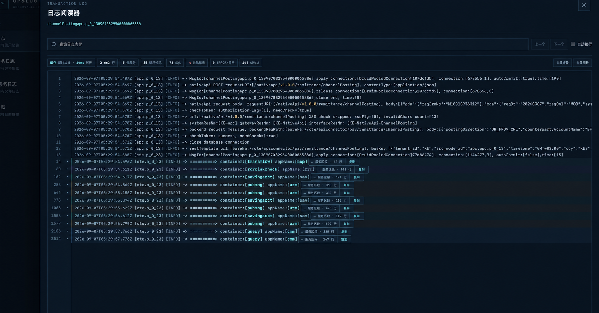
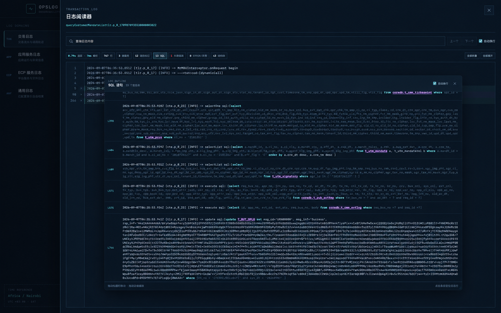
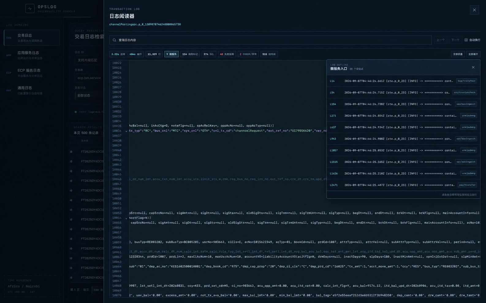

# OpsLog

<p align="center">
  <strong>为复杂微服务日志而生的跨平台日志工作台</strong>
</p>

<p align="center">
  把散落在海量文本中的 SQL、错误、请求报文和跨服务调用，整理成可以快速定位、折叠阅读与复用分析的清晰视图。
</p>

<p align="center">
  <a href="https://github.com/AlawnCN/opslog/releases">下载最新版本</a>
  ·
  <a href="#首次使用">快速开始</a>
  ·
  <a href="#开发">本地开发</a>
</p>



OpsLog 是原 `opslog-1.0.11.jar` 的现代化跨平台替代版。它不仅用于“查到日志”，更关注如何让工程师在数千乃至数万行调用记录中快速看懂上下文、锁定异常并复用排查经验。

桌面端基于 React、Tauri 与 Rust 构建。Kibana 查询、日志下载和文件导出均由使用者本机发起，可以直接沿用本机 VPN 与网络权限，无需额外部署中转查询服务；安装后也不依赖 Java、Node.js 或独立 Web 服务。

## 为什么选择 OpsLog

| 能力 | 带来的价值 |
| --- | --- |
| 结构化日志阅读 | 自动识别并着色 SQL、JSON、XML、Java 对象、错误码、错误信息和平台唯一追踪号，重点信息不再淹没在原始文本中。 |
| 跨服务调用分段 | 识别微服务入口，以不同背景区分服务边界；服务段、JSON、XML 和 Java 对象可独立折叠，互不干扰。 |
| Outline 快速导航 | SQL、异常、失败线索、调用标记、结构块和微服务入口都能生成导航列表，点击即可跳转到对应日志行。 |
| 自定义标记 | 使用普通文本或正则表达式建立可复用的排查标记；支持多条件组合、排序、改名、克隆以及导入导出。 |
| 局域网协作 | 桌面端一键开启 LAN 分享，同事可直接用浏览器访问；查询继续由主机通过本机 VPN 发起，环境凭据不会下发到浏览器。 |
| 高延迟网络优化 | 对查询结果和日志正文进行本地缓存，区分远程请求与本地解析耗时，减少跨洲 VPN 环境下的重复等待。 |
| 工作状态记忆 | 记住字段顺序、列宽、阅读器宽度、Outline 位置与大小、自动换行和折叠状态，让下一次打开延续上次习惯。 |

## 让日志自己呈现重点

### 从 SQL 列表直达关键语句

OpsLog 会识别普通与嵌套 SQL，弱化冗长的查询字段和条件值，同时突出表名、连接关系与关键字。点击 SQL 统计标记即可打开 Outline，在多条语句之间快速定位，无需反复滚动查找。



### 把跨服务调用变成可浏览的章节

微服务入口会被自动识别并形成独立段落。Outline 提供每个服务入口的行号、内容预览和服务名称；窗口支持拖动、缩放、自动换行与水平滚动，并记住上一次的位置和大小。



### 为团队沉淀可复用的排查路径

自定义标记不是一次性的搜索历史，而是一套轻量日志分析模板：

- 一个标记可包含多个文本或正则查询子项，并保留明确的命中来源。
- 支持拖拽排序、双击改名、克隆、编辑和移除子项。
- 标记可以导出为带版本信息的 JSON 文件，也可以追加导入并自动跳过完全重复项，便于团队共享。
- 搜索结果支持上一个/下一个命中跳转，复杂正则也能直接生成 Outline。

## 主要功能

- 交易日志、应用服务日志、ECP 服务日志和通用日志统一检索。
- 分页查询、可选字段、拖拽调整字段顺序、列宽记忆与固定快捷操作列。
- 在线结构化阅读、TRC 原始文件下载、CSV 导出和 Trace 调用链查看。
- `req_bus_no` / `reqBusNo`、`msg_cd` / `msgCd`、`msg_inf` / `msgInf` 等关键字段语义高亮。
- JSON、XML、Java 对象和跨服务日志段落折叠，并支持一键复制完整折叠内容。
- 日志正文普通搜索与正则搜索，支持 Enter 跳转、自动换行和命中计数。
- 键盘操作：输入查询条件后按 Enter 执行；Esc 逐层退出焦点和浮层；macOS 使用 `Command + F`、Windows 使用 `Alt + F` 聚焦日志搜索。
- CSV/TRC 直接保存到系统“下载”目录，操作期间提供对应加载反馈并避免重复触发。
- 桌面端可按需开启 LAN 分享并复制访问地址，浏览器端沿用主机已有环境配置与 VPN 链路；退出应用后分享服务自动停止。
- macOS 与 Windows 桌面端自动检查更新，展示版本说明，并在用户确认后完成下载、验签、安装与重启。
- Kibana 用户名和密码仅由本地进程读取，不会交给远程服务器或浏览器页面。

## 首次使用

1. 启动 OpsLog。
2. 点击右上角“导入配置”，选择兼容原程序的 `opslog-envs.json`。
3. 连接公司 VPN，然后选择环境并查询。

需要与同一局域网的同事协作时，可点击顶部 `LAN` 开关，选择无口令或使用自动生成的访问口令，然后复制完整 Share URL。口令保存在 URL 片段中，不会进入 HTTP 请求地址或 Referer；浏览器只会通过专用请求头提交给主机校验。访问者看到的是只读环境配置，不能从浏览器导入或覆盖主机配置；Kibana 用户名与密码始终保留在主机进程内，实际查询通过主机当前网络和 VPN 发起。即使启用了口令，也只应在可信局域网内临时开启，用完立即关闭。

应用不会把真实环境配置打进安装包。导入后配置复制到系统应用配置目录；在 macOS/Linux 上文件权限自动设为 `0600`。

兼容字段：`name`、`kibanaUrl`、`username`、`password`、`txnlstIndex`、`txntrcIndex`、`applogIndex`。另外支持：

- `apmIndex`：APM 索引，缺省为 `traces-apm*`。
- `allowInsecureTls`：仅用于证书无法验证的遗留环境，缺省为 `false`。旧配置中的 Faulu 生产/UAT Kibana IP 会在内存中迁移为对应证书域名，保持严格 TLS 校验。

也可把 `opslog-envs.json` 放在可执行文件旁，或通过 `OPSLOG_CONFIG_PATH` 指定路径，适合内部便携包。

## 开发

需要 Node.js 22+、Rust 1.85+ 和对应平台的 Tauri 系统依赖。

```bash
npm install
npm run desktop:dev
```

保留的浏览器开发模式：

```bash
npm run dev
```

浏览器模式访问 `http://127.0.0.1:5173`，本地查询网关只监听 `127.0.0.1`。

需要从局域网设备访问时，使用下面的命令；它会同时启动 Vite 页面和本地查询网关：

```bash
npm run dev:lan
```

随后通过 `http://<本机局域网 IP>:5173` 访问即可。不要单独运行 `npm run web:dev -- --host 0.0.0.0`，该命令只启动页面，无法提供查询或导入接口。

## 构建和分发

必须在目标操作系统上生成正式安装包。

macOS：

```bash
npm run desktop:macos
```

生成 `.app` 和 `.dmg`。当前机器生成的位置：

- `src-tauri/target/release/bundle/macos/OpsLog.app`
- `src-tauri/target/release/bundle/dmg/OpsLog_<版本>_aarch64.dmg`

Windows x64（在 Windows x64 构建机执行）：

```powershell
npm install
npm run desktop:windows:setup
```

生成 NSIS 安装程序和 `src-tauri/target/release/opslog.exe`。正式 Release 同时提供 `OpsLog_<版本>_windows_x64_setup.exe` 与 `OpsLog_<版本>_windows_x64_portable.zip`；绿色包解压后直接运行 `OpsLog.exe`。目标电脑需有 Microsoft WebView2 Runtime（Windows 10/11 通常已自带）。

每个 GitHub 版本标签自动生成以下完整交付矩阵：

- Windows x64：NSIS 安装版与绿色 ZIP。
- macOS Apple Silicon（arm64）：DMG 与便携 `.app` ZIP。
- macOS Intel（x64）：DMG 与便携 `.app` ZIP。
- 自动更新：Windows NSIS 更新包、macOS arm64/x64 更新包、对应数字签名与 `latest.json`。
- `SHA256SUMS`：全部包和更新元数据的完整性校验清单。

Windows ARM64 本轮暂由 Windows x64 包通过系统的 x64 仿真层运行；待引入受支持的 ARM64 Windows 构建与签名环境后，再增加原生 ARM64 包。

对外分发前建议分别配置 Apple Developer ID 和 Windows Authenticode 代码签名，避免系统显示“未知开发者”。内部测试可直接使用未公证/未签名构建。

### macOS 未公证包的首次启动

当前 Release 未使用 Apple Developer ID 签名和公证；只应从本项目的 GitHub Release 下载，并先对照同一 Release 的 `SHA256SUMS` 确认完整性。将应用拖入“应用程序”目录后，如果 macOS 拦截启动，通常只需在终端执行：

```bash
xattr -dr com.apple.quarantine /Applications/OpsLog.app
```

该命令只移除下载文件的隔离属性，不会把应用伪装成已由 Apple 签名或公证。若仍提示“无法验证开发者”，请右键应用选择“打开”，或在“系统设置 → 隐私与安全性”中点击“仍要打开”。若仍无法启动，请重新下载并校验 `SHA256SUMS`；不要通过 ad-hoc 重签名来规避问题。

## 自动更新与签名

桌面端使用 Tauri 官方更新机制：启动约 3 秒后静默检查，点击右上角版本号也可手动检查。检测到新版本后会展示版本与更新说明；只有用户确认后才下载，且必须通过内置公钥校验才会安装。Windows 使用被动安装模式，macOS 与 Windows 安装完成后都会重新启动应用。Web 版不执行桌面自动更新。

正式发布构建使用 `src-tauri/tauri.release.conf.json` 开启更新产物，普通本机构建不要求提供签名私钥。GitHub Actions 需要配置以下 Repository Secrets：

- `TAURI_SIGNING_PRIVATE_KEY`：Tauri updater 私钥全文。
- `TAURI_SIGNING_PRIVATE_KEY_PASSWORD`：私钥口令。

当前开发机的私钥保存在 `~/.config/opslog/updater.key`（权限 `0600`），口令保存在 macOS 钥匙串服务 `com.murong.opslog.updater`。私钥、口令和真实环境配置都禁止提交到仓库。配置 Secrets 后，推送 `v*` 标签会生成签名更新包和 `latest.json`，客户端从 GitHub Release 的公开静态地址读取更新信息，无需在应用中保存 GitHub Token。

## 验证

```bash
npm run typecheck
npm test
cd src-tauri && cargo test
```

完整桌面安装包：

```bash
npm run desktop:build
```
