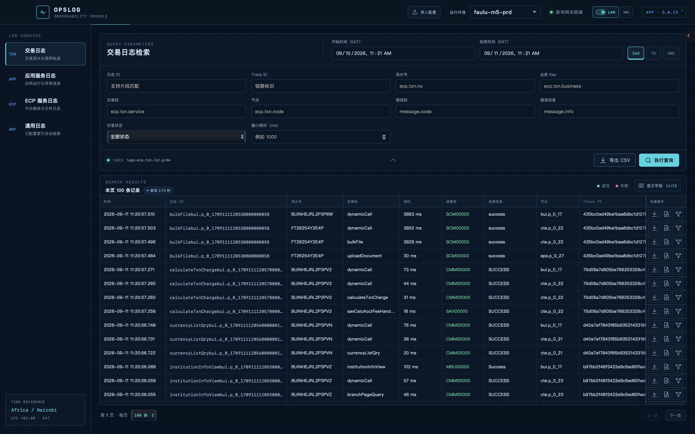
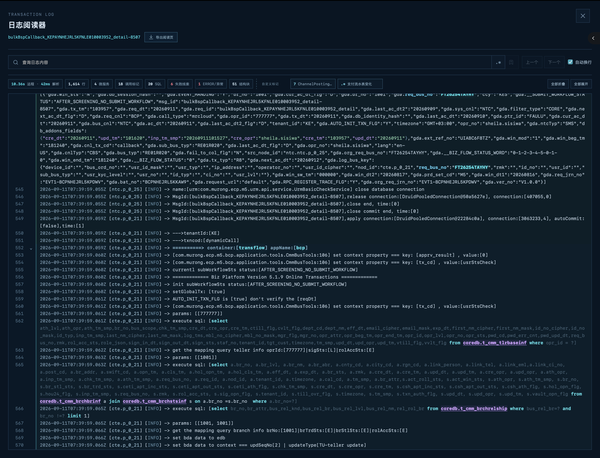
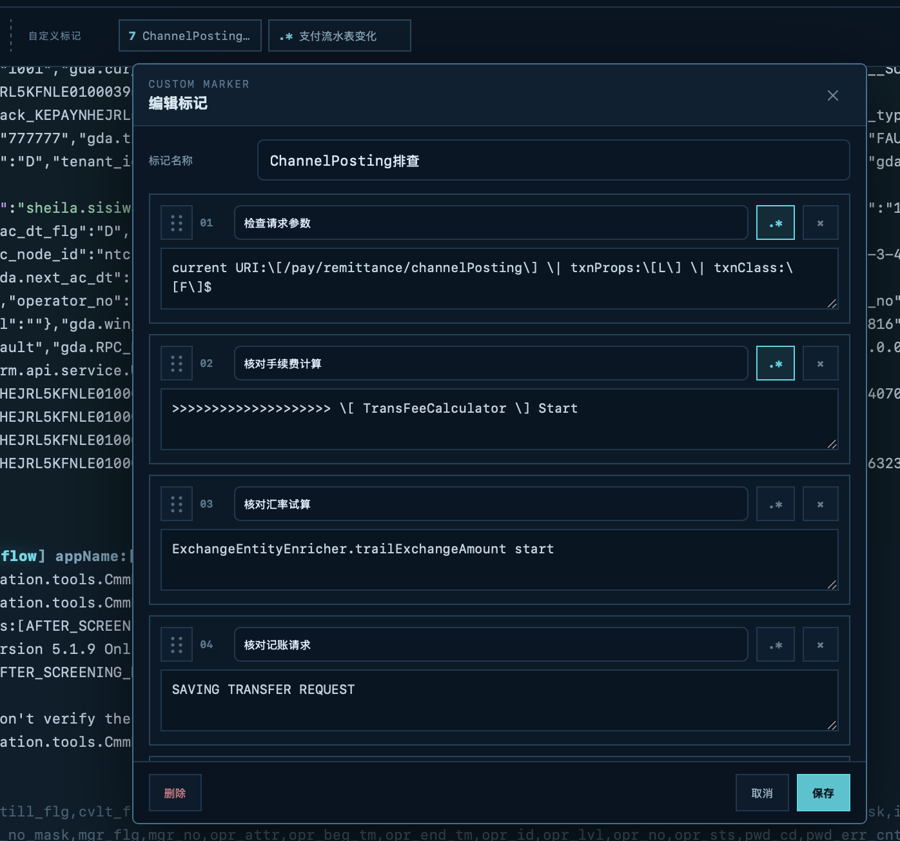
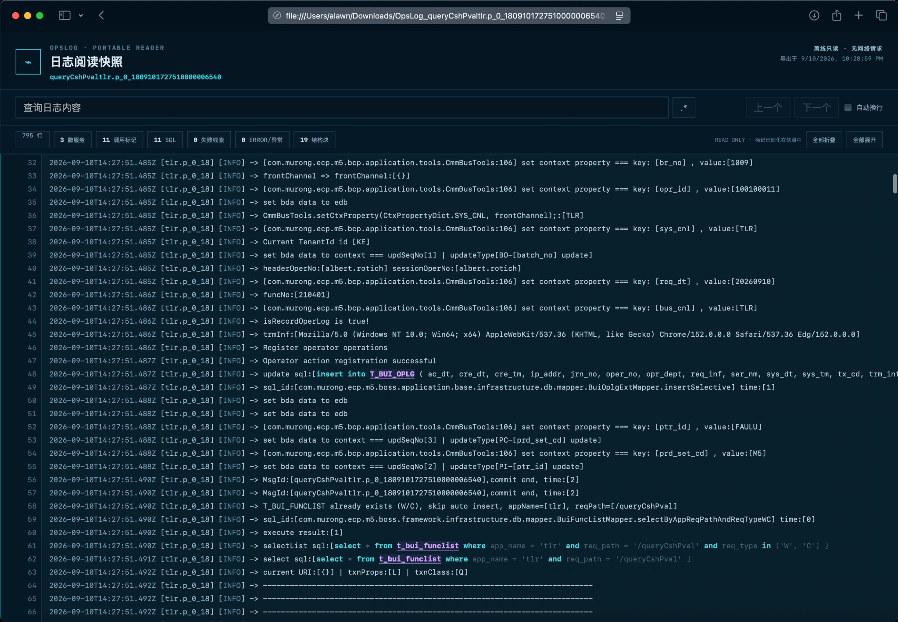
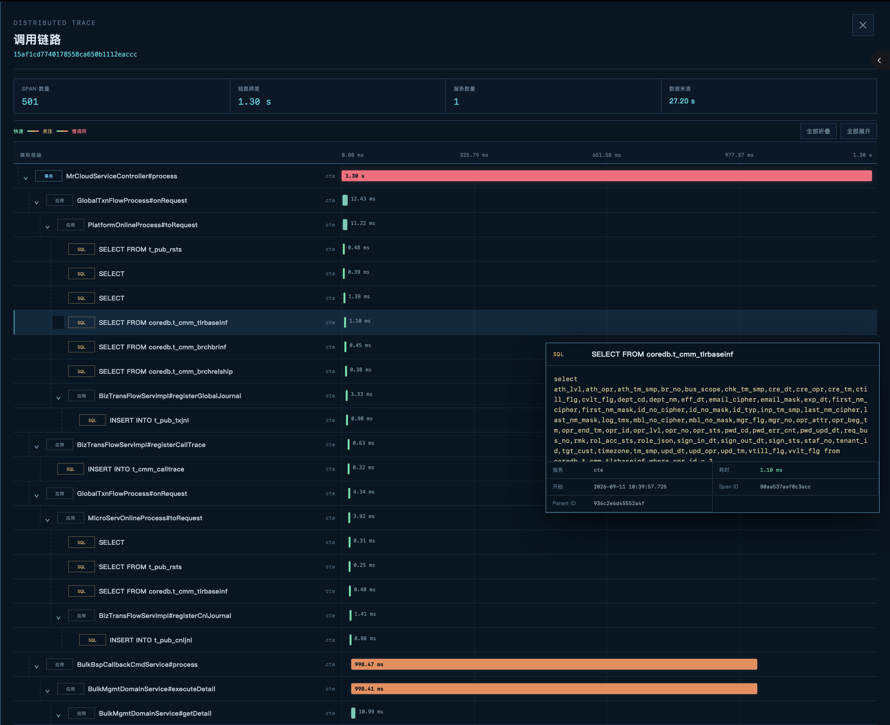
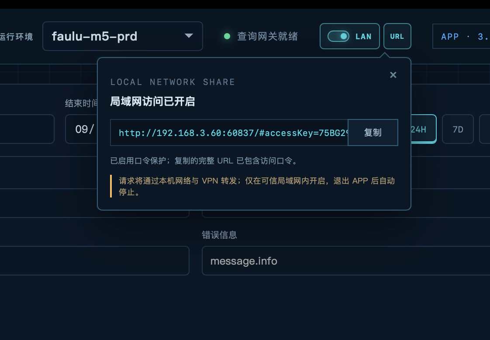
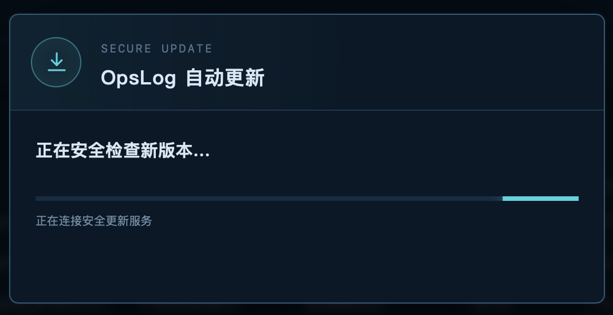

# OpsLog

<p align="center">
  <strong>ELK / Kibana 日志检索、结构化阅读与 Trace 分析</strong>
</p>

<p align="center">
  面向微服务排障的跨平台桌面工具，提供 macOS、Windows 与局域网 Web 访问。
</p>

<p align="center">
  <a href="https://github.com/AlawnCN/opslog/releases">下载</a>
  ·
  <a href="#核心功能">核心功能</a>
  ·
  <a href="#快速开始">快速开始</a>
  ·
  <a href="#开发与发布">开发与发布</a>
</p>

<p align="center">
  
</p>

OpsLog 直接连接现有 Kibana，查询、下载和导出均由本机完成，可沿用当前网络与 VPN。桌面端安装后不依赖 Java、Node.js 或独立查询服务。

## 核心功能

### 日志阅读

自动识别 SQL、JSON、XML、Java 对象、微服务边界、错误信息与关键业务字段。

- SQL 关键字及表名高亮，支持普通与嵌套 SQL。
- 服务段和结构化数据独立折叠，可复制完整内容。
- 内置微服务、调用标记、SQL、失败线索、异常及结构块导航。
- 支持普通搜索、正则搜索、命中计数和 Outline 跳转。

<p align="center">
  
</p>

### 自定义标记

通过有序查询规则定义排查模板。每条规则支持独立名称、普通文本或正则表达式，Outline 会标明具体命中规则。

- 支持规则增删、排序及标记改名、克隆、合并。
- 支持标记导入与导出，便于团队共享。
- 标记区域可调整宽度，超出可见范围时自动收纳。

<p align="center">
  
</p>

### 独立 TRC 阅读器

Release 同时提供独立的 OpsLog Reader。首次启动可自行选择是否关联 `.trc` 文件；不关联也可手动打开。阅读、搜索、折叠、结构预览和自定义标记沿用 OpsLog 的同一套实现，两端共享阅读偏好与标记配置。

### AI 日志分析

桌面端与本机 Web 阅读器均可调用 OpenAI、Grok、Gemini、DeepSeek、Kimi、Ollama、LM Studio 或自定义兼容服务分析当前日志。分析上下文自动包含日志摘要、内置标记和当前自定义标记规则；系统 Prompt、模型、协议及上下文上限均可配置。

OpsLog 与 OpsLog Reader 共用 AI 配置。API Key 仅写入本机共享配置目录，并在 macOS / Linux 下限制为当前用户可读写；使用云端模型前需确认日志数据符合所在组织的数据安全要求。

### 可交互 HTML

日志可导出为单个只读 HTML 文件，在浏览器中离线打开。文件保留语义高亮、结构折叠、普通及正则搜索、内置标记、自定义标记和 Outline 跳转，无需安装 OpsLog。

<p align="center">
  
</p>

### Trace 分析

按父子 Span 展示分层时间瀑布，统一呈现开始位置、持续时间与调用类型。

- 耗时按等级着色，支持节点折叠和窗口宽度调整。
- 悬停查看完整 SQL、服务、时间及 Span 上下文。

<p align="center">
  
</p>

### LAN 分享

桌面端可临时向局域网开放 Web 版。查询经主机网络和 VPN 转发，环境凭据不下发到浏览器。

- 支持无口令或口令访问，复制的 Share URL 可包含访问口令。
- 浏览器不能导入或覆盖主机配置。
- 关闭 LAN 或退出应用后自动停止分享。

<p align="center">
  
</p>

> LAN 模式仅用于可信局域网内的临时协作。

### ES 查询性能

- 桌面端与 Web 查询网关复用 HTTP / HTTPS 连接。
- 日志正文按环境和日志 ID 进行会话缓存；最新 20 分钟内的日志实时读取，不进入缓存。
- 详情查询优先使用交易时间前后 1 小时作为锚点，必要时自动扩展范围。
- 分别显示远程查询和本地解析耗时。

### 自动更新

macOS 与 Windows 桌面端支持自动更新。更新窗口展示完整 Changelog，更新包通过 Tauri 数字签名校验后安装。Web 版不执行桌面更新。

<p align="center">
  
</p>

## 其他功能

- 交易日志、应用服务日志、ECP 服务日志与通用日志统一检索。
- 分页、字段选择、字段排序、列宽调整、CSV 导出和 TRC 下载。
- 记忆字段布局、阅读器宽度、Outline 位置、换行和折叠状态。
- 键盘操作：`Enter` 执行，`Esc` 退出焦点或关闭浮层，`Command + F` / `Alt + F` 聚焦日志搜索。

## 快速开始

1. 从 [GitHub Releases](https://github.com/AlawnCN/opslog/releases) 下载对应平台版本。
2. 启动 OpsLog，在“配置”中导入 `opslog-envs.json`，或直接新增环境。
3. 连接 VPN，选择运行环境后查询。

环境配置不会写入安装包。导入后的配置保存在系统应用配置目录；macOS / Linux 下文件权限为 `0600`。

环境配置支持选定部分环境导入、导出。普通导出不包含 `password` 字段；勾选“包含密码”后，只有实际配置的 ELK 或 SSH 密码会分别写入加密区，不使用密码的连接仍不生成 `password` 字段。整份文件使用同一个导出加密口令导入，但每个连接密码使用独立随机盐和随机 IV 加密；口令本身不写入文件。旧版加密导出仍可导入。SSH 私钥文件不包含在配置导出中。

<details>
<summary><strong>配置字段</strong></summary>

兼容字段：`name`、`kibanaUrl`、`username`、`password`、`txnlstIndex`、`txntrcIndex`、`applogIndex`。

- `apmIndex`：APM 索引，默认 `traces-apm*`。
- `allowInsecureTls`：允许遗留环境使用无法验证的证书，默认 `false`。

也可将 `opslog-envs.json` 放在可执行文件旁，或通过 `OPSLOG_CONFIG_PATH` 指定路径。

</details>

## 开发与发布

<details>
<summary><strong>本地开发</strong></summary>

需要 Node.js 22+、Rust 1.85+ 和对应平台的 Tauri 系统依赖。

```bash
npm install
npm run desktop:dev
npm run reader:dev
```

浏览器模式：

```bash
npm run dev
```

局域网联调：

```bash
npm run dev:lan
```

不要单独使用 `npm run web:dev -- --host 0.0.0.0`；该命令不启动查询与导入接口。

</details>

<details>
<summary><strong>构建安装包</strong></summary>

安装包须在目标操作系统构建。

```bash
# macOS
npm run desktop:macos
npm run reader:macos
```

```powershell
# Windows x64
npm install
npm run desktop:windows:setup
npm run reader:windows:setup
```

GitHub Release 同时生成 OpsLog 与 OpsLog Reader 的 Windows x64 安装版、绿色 ZIP、macOS Apple Silicon / Intel DMG 及便携 ZIP。OpsLog 的更新包、签名、`latest.json` 与全部资产校验汇总在同一 Release 中。

</details>

<details>
<summary><strong>macOS 未公证包</strong></summary>

当前 Release 未使用 Apple Developer ID 签名和公证。请从项目 GitHub Release 下载，并核对 `SHA256SUMS`。

若 macOS 拦截启动：

```bash
xattr -dr com.apple.quarantine /Applications/OpsLog.app
```

该操作只移除下载隔离属性，不代表应用已经由 Apple 签名或公证。

</details>

<details>
<summary><strong>自动更新签名</strong></summary>

正式构建通过 `src-tauri/tauri.release.conf.json` 开启更新产物。GitHub Actions 需要配置：

- `TAURI_SIGNING_PRIVATE_KEY`
- `TAURI_SIGNING_PRIVATE_KEY_PASSWORD`

私钥、口令和真实环境配置禁止提交到仓库。Tauri updater 签名不等同于 Apple Developer ID、公证或 Windows Authenticode。

</details>

<details>
<summary><strong>验证</strong></summary>

```bash
npm run typecheck
npm test
cd src-tauri && cargo test
```

</details>
